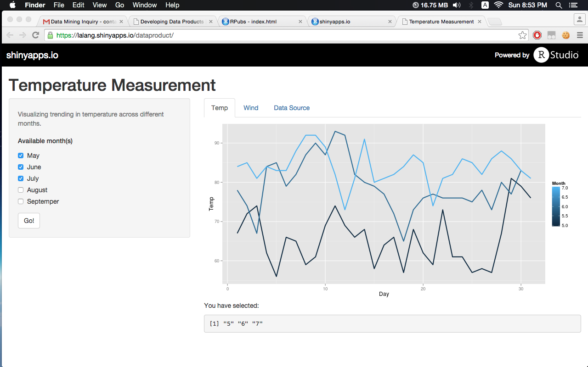
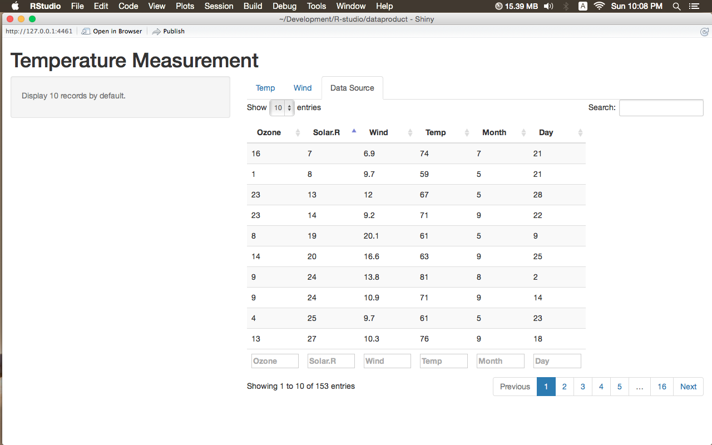

## Objectives

1. Demonstrate the ability of using basic shiny app
2. Slide 1: reactive output display with isolate. GGplot2 is used. Temperature on Monthly basis is recorded.
3. Slide 2: rCharts integration for Wind Measurement on regular daily basis
4. Data Source Interaction - airquality.

Warning: For some reasons, the app occasionally fails to get resource from shiny server. Please evaluate my apps locally.

--- .class #id 

## Temperature Measurement on Monthly basis

{{{ content }}}
<footer class = 'logo'>
  </img>
</footer>


This is the link to the shiny app: https://lalang.shinyapps.io/dataproduct/


---
## Wind Measurement classified by Day
```{r results='asis',echo=FALSE, message=FALSE}
library(UsingR)
require(rCharts)
require(knitr)
data(airquality)

p1 <- rPlot(Wind~Day, data=airquality, color="Month",type="point",size = list(const = 3))
         p1$addParams(width = 600, height = 400, dom = 'chart1',
                     title = " Wind Scatter Plot on regular daily basis")
         p1$guides(x = list(title = "", min = 0,max = 32 ))
         p1$guides(y = list(title = "", max = 22))
        p1
```

This is the link to the shiny app: https://lalang.shinyapps.io/dataproduct/

---
## Data Source Interaction 
{{{ content }}}
<footer class = 'logo'>
  </img>
</footer>


This is the link to the shiny app: https://lalang.shinyapps.io/dataproduct/
