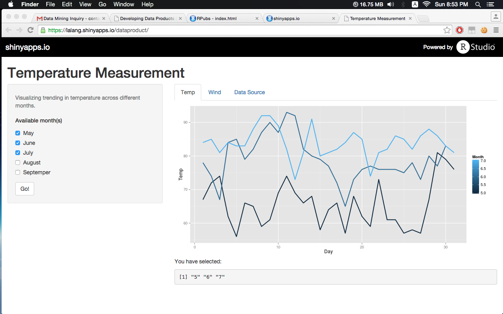
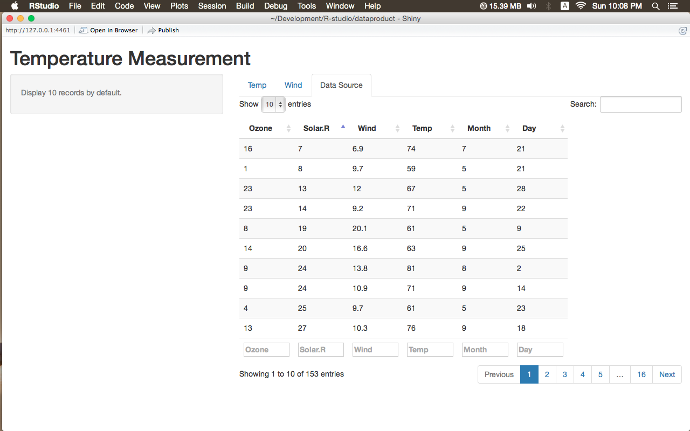

## Objectives

1. Demonstrate the ability of using basic shiny app
2. In Slide 1, reactive output display with isolate. GGplot2 is used. Temperature on Monthly basis is recorded.
3. Slide 2 presents Wind Measurement on regular daily basis using scatter plot
4. Data Source Interaction - airquality.

---

## Temperature Measurement on Monthly basis
Temperature is remarkbly higher in middle of summer.
<footer class = 'logo'>
  </img>
</footer>


This is the link to the shiny app: https://lalang.shinyapps.io/dataproduct/

--- &twocol w1:40% w2:60%
## Wind Measurement classified by Day
*** =right
```{r graph1, results='asis',echo=F, message=FALSE,tidy=TRUE}
library(UsingR)
require(ggplot2)
require(knitr)
data(airquality)

ggplot(airquality, aes(Day, Wind, color = Month))+geom_point()+geom_line(stat = "hline", yintercept = "mean", aes(colour = Month))
```
*** =left
- The variation of wind's velocity is generally low at the beginning of autumn. In contrast, summer's days have fluctuated pattern. 
- Top windy day is around 15-17 in June.

--- 

## Wind Measurement classified by Day (cont)

To plot the wind measurement on daily basis, we use ggplots2 and the avg line

```{r ,echo=T}
require(ggplot2)
require(knitr)
data(airquality)

p1 <- ggplot(airquality, aes(Day, Wind, color = Month))+
        geom_point()+
        geom_line(stat = "hline", yintercept = "mean", aes(colour = Month))
```
This is the link to the shiny app: https://lalang.shinyapps.io/dataproduct/

---

## Data Source Interaction 
Data manipulation can be done in R while navigating the data source tab.
<footer class = 'logo'>
  </img>
</footer>

This is the link to the shiny app: https://lalang.shinyapps.io/dataproduct/
